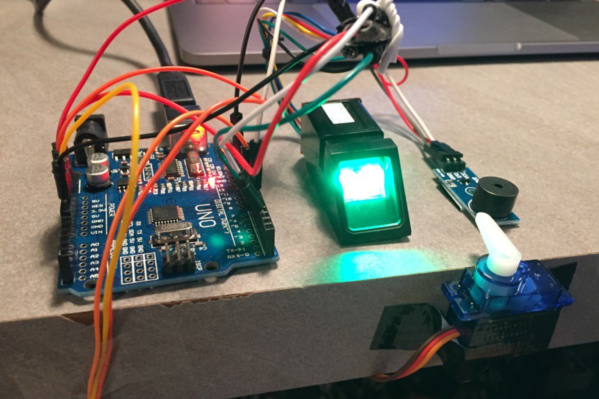

# Arduino Lock Desk Drawer
> arduino, locker, fingerprint, sensor, drawer, step motor

Arduino locker for your desk drawer using fingerprint sensor &amp; buzzer &amp; servo.

## Features

TODO

## Getting started

TODO

## Useful links

 - [Enrolling fingerprint](https://learn.adafruit.com/adafruit-optical-fingerprint-sensor/enrolling-with-arduino)
 - [Fingerprint element](http://tinkersphere.com/sensors/1241-fingerprint-scanner-sensor-arduino-compatible.html)
 - [Buzzer: Use tone() with Arduino to make noise](https://programmingelectronics.com/an-easy-way-to-make-noise-with-arduino-using-tone/)

